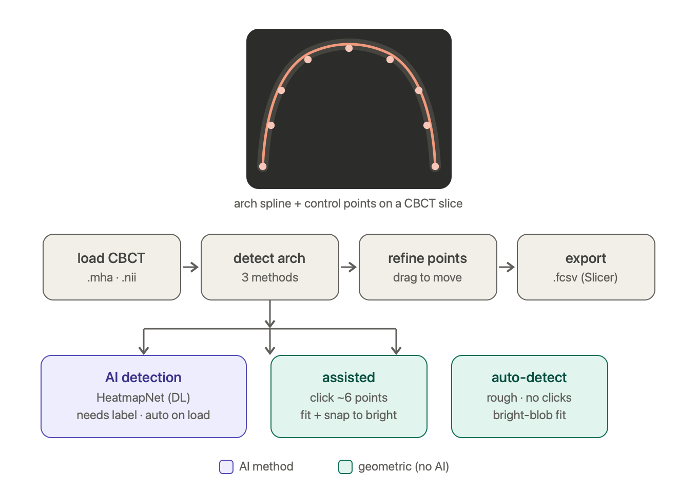

# CBCT Dental Arch Spline Detector

AI-assisted tool for detecting and annotating dental arch splines on CBCT (Cone Beam CT) axial slices.

Inspired by margin line detection on 3D meshes, adapted for 2D CBCT imaging. A U-Net predicts a heatmap of control point locations; the user can then refine the result interactively in a GUI annotator.

## GUI feature pipeline



Load a CBCT, detect the arch by one of three methods (AI, assisted, or automatic
geometric), refine the control points, then export a Slicer `.fcsv`.

---

## Overview

Each CBCT case produces one annotated axial slice with ~17–32 control points forming a U-shaped dental arch. The pipeline:

1. Extracts the relevant axial slice from the NIfTI volume
2. Trains a U-Net to predict a heatmap of control point locations
3. Post-processes the heatmap into ordered control points + a smooth B-spline
4. Lets the user refine points in an interactive GUI
5. Exports annotations in Slicer `.fcsv` format

---

## Repository Structure

```
cbct_arch_spline/
├── config.py                   # All hyperparameters and paths
├── requirements.txt
│
├── data/
│   ├── preprocessing.py        # NIfTI loading, HU windowing, slice extraction
│   └── dataset.py              # PyTorch dataset: slice + Gaussian heatmap pairs
│
├── models/
│   └── unet.py                 # EfficientNet-B3 U-Net (or SimpleUNet fallback)
│
├── spline/
│   ├── fcsv_io.py              # Read/write Slicer .fcsv, LPS ↔ voxel coordinates
│   └── spline_utils.py         # B-spline fitting, arch ordering, metrics
│
├── training/
│   ├── losses.py               # FocalMSE loss (upweights keypoint pixels)
│   └── trainer.py              # Training loop, AdamW + cosine LR schedule
│
├── inference/
│   └── predictor.py            # ArchPredictor: slice → heatmap → keypoints
│
├── gui/
│   └── app.py                  # Interactive PyQt5 annotator
│
└── scripts/
    ├── explore_annotations.py  # Visualise .fcsv arches (no CBCT needed)
    ├── train.py                # Train the model
    ├── evaluate.py             # Compute metrics on a test set
    └── annotate.py             # Launch the GUI
```

---

## Installation

```bash
pip install -r requirements.txt
```

Requirements: Python ≥ 3.9, PyTorch ≥ 2.0, nibabel, PyQt5, timm, scikit-image, SimpleITK.

---

## Data Format

### CBCT volumes
Supported formats:
- **ITK MetaImage** (`.mha`, `.mhd`, `.nrrd`) — e.g. the ToothFairy2 dataset, read via SimpleITK
- **NIfTI** (`.nii`, `.nii.gz`) — read via nibabel

Files are named `{case_id}.mha` (or `.nii.gz`). Both backends are normalised
internally to the same conventions (voxel→RAS affine, `(i, j, k)` array order),
so all downstream coordinate math is identical regardless of source format.
Expected Hounsfield Unit range: −500 to +2000 (dental CBCT).

The training/eval scripts look for volumes both directly in `--cbct_dir` and in
a nested `imagesTr/` subfolder (nnU-Net / ToothFairy2 layout):

```
Dataset112_ToothFairy2/
├── imagesTr/
│   ├── ToothFairy2F_001_0000.mha
│   └── ...
└── labelsTr/
```

### Annotations
Slicer `.fcsv` fiducial files — one per case, same stem as the volume file
(`ToothFairy2F_001_0000.mha` ↔ `ToothFairy2F_001_0000.fcsv`).

```
# CoordinateSystem = LPS
# columns = id,x,y,z,...
1, 31.98, 101.81, 34.5, ...
2, 36.37,  84.00, 34.5, ...
...
```

All control points in a given case share the same `z` coordinate (a single axial slice).  
The project ships with **163 annotated cases** in `arch_points_manual/`.

---

## Usage

### 1. Explore annotations (no CBCT files needed)

```bash
python3 scripts/explore_annotations.py           # 3×3 grid of 9 cases
python3 scripts/explore_annotations.py --n 20   # show 20 cases
python3 scripts/explore_annotations.py --case ToothFairy2F_001_0000
```

### 2. Train

```bash
python3 scripts/train.py \
    --cbct_dir /path/to/nifti_files \
    --epochs 100 \
    --batch_size 8
```

Checkpoints are saved to `saved_models/` as `arch_detector_best.pth` and `arch_detector_last.pth`.

Options:
| Flag | Default | Description |
|------|---------|-------------|
| `--cbct_dir` | required | Directory with `.nii.gz` files |
| `--fcsv_dir` | `arch_points_manual/` | Directory with `.fcsv` files |
| `--epochs` | 100 | Number of training epochs |
| `--batch_size` | 8 | Batch size |
| `--lr` | 1e-4 | Learning rate |
| `--no_pretrained` | False | Use SimpleUNet instead of EfficientNet-B3 |

### 3. Evaluate

```bash
python3 scripts/evaluate.py \
    --cbct_dir /path/to/nifti_files \
    --checkpoint saved_models/arch_detector_best.pth
```

Reports mean / median distance (pixels) from predicted points to the ground-truth spline.

### 4. Interactive annotation GUI

```bash
# Empty GUI
python3 scripts/annotate.py

# Pre-load CBCT + annotation
python3 scripts/annotate.py \
    --cbct /path/to/case.nii.gz \
    --fcsv /path/to/case.fcsv

# Pre-load with trained model
python3 scripts/annotate.py \
    --cbct /path/to/case.nii.gz \
    --model saved_models/arch_detector_best.pth
```

---

## GUI Controls

| Action | How |
|--------|-----|
| Load CBCT | File menu or "Load CBCT" button |
| Scroll slices | Slider or ← / → arrow keys |
| Run AI detection | "Detect Arch (AI)" button |
| Add control point | Left-click on empty space (or Shift+click) |
| Move control point | Left-click + drag a point |
| Delete control point | Right-click on point |
| Re-order points | "Re-order Points" button |
| Generate panoramic | "Generate Panoramic" button (Panoramic panel) |
| Save annotation | Ctrl+S or "Save .fcsv" button |

---

## Annotating Without a Trained Model (Geometric Workflow)

Before you have trained a model, use the **Geometric (no AI)** panel. The
recommended, reliable workflow needs only a handful of clicks:

1. Scroll to the slice you want to annotate.
2. **Click ~6 points** roughly along the arch (e.g. both rear molars and a few
   points in between — they don't need to be precise). Clicking empty space adds
   a point; clicking an existing point lets you drag it.
3. Click **"Fit Arch from Clicks"** → your clicks become a smooth, evenly-spaced
   spline of N control points (set N with the spinbox, default 24).
4. *(Optional)* Click **"Snap to Bright"** to nudge each point onto the nearest
   tooth / cortical bone.
5. Drag any individual point to fine-tune, then **Ctrl+S** to save.

This works on every slice — including those with no clean tooth row — because
*you* supply the anatomical prior with the clicks; the geometry just smooths and
resamples them.

There is also an **"Auto-detect (rough)"** button that tries fully-automatic
blob detection with no clicks. It only works when a clean tooth row is present
in the slice, and is meant purely as a draft to refine. For consistent results,
prefer the click-assisted method above.

The methods live in [`inference/geometric.py`](cbct_arch_spline/inference/geometric.py):
`assisted_arch_from_clicks`, `snap_points_to_bright`, and `auto_detect_arch`.

---

## AI Detection (HeatmapNet)

The trained deep-learning method lives in
[`cbct_arch_spline/dl/`](cbct_arch_spline/dl/) and powers the GUI's
**"AI Detection"** panel. It predicts the whole arch in one shot from a 2D
maximum-intensity projection (MIP) of the jaw plus its tooth/bone segmentation.
This is the winning architecture from an internal comparison — **HeatmapNet**
(Payer et al., MICCAI 2016), **~4.0 mm** mean curve distance vs. 16.1 mm for the
previous ResNet + residual-correction approach.

**How it works.** For the chosen jaw it takes a z-range MIP of the CBCT, the
matching label MIP, and a rendered geometric-baseline arch as a 3-channel image,
runs a **U-Net encoder–decoder** that outputs one 2D Gaussian **heatmap per
control point**, and recovers each `(x, y)` via **soft-argmax** (a jaw/geometry-
conditioned MLP then applies a small correction). The result is written as a
Slicer `.fcsv` in the same LPS format as the manual annotations and loaded back
through the GUI's normal annotation loader.

**Usage in the GUI:**
1. Load a CBCT. The matching label volume is auto-found via the ToothFairy2
   convention (`imagesTr/<case>_0000.mha` → `labelsTr/<case>.mha`); otherwise
   click **"Load Label"**.
2. Pick the **jaw** (lower / upper).
3. Click **"Detect Arch (AI)"** — or just leave **"Auto-detect on load"** on and
   it runs automatically when the CBCT loads.
4. Refine the predicted points by dragging, then **Ctrl+S**.

**Standalone CLI** (useful for testing before the GUI):
```bash
python3 cbct_arch_spline/dl/dl_arch_predictor.py \
    --cbct  imagesTr/ToothFairy2F_001_0000.mha \
    --label labelsTr/ToothFairy2F_001.mha \
    --checkpoint cbct_arch_spline/dl/final_model.pt \
    --jaw lower \
    --pipeline_path cbct_arch_spline/dl/drr_pipeline_v4.py \
    --out_fcsv prediction.fcsv
```

**Caveats:**
- **Lower jaw is reliable; upper jaw is preliminary** — the model was trained on
  155 lower-jaw vs only 6 upper-jaw cases.
- HeatmapNet is a **from-scratch U-Net** (no ImageNet backbone), so no weight
  download is needed and the 6 MB checkpoint is self-contained.
- **Input normalisation:** the stand-alone hand-off code fed the MIP channel in
  raw Hounsfield units, which collapsed every prediction into an off-canvas loop.
  The integrated version windows the MIP to `[0, 1]`
  (`HU_WINDOW = (-1000, 2000)` in `dl_arch_predictor.py`) before the network,
  which restores correct arches. If you have the original training dataloader,
  confirm this matches its exact normalisation.
- The model works on the **whole jaw volume**, not a single slice — its arch is
  valid across all jaw slices, so the GUI keeps your current slice when loading
  the prediction (`keep_slice=True`).

---

## Panoramic Reconstruction (spline → panoramic)

The GUI's **Panoramic** panel turns the current arch spline into a panoramic
(OPG-style) radiograph. The spline defines the dental arch curve; the volume is
resliced along that curve — casting curved rays through a focal trough — to
"unroll" the jaw into a single flat wide image.

The GUI shows three columns: the **controls** (left), the **axial slice with the
editable spline** (middle), and the **generated panoramic** (right). Edit the
spline (drag points, re-detect, etc.) and click **Generate Panoramic** again to
update the view; **Save Panoramic (.png)** exports it.

The reconstruction is done by
[`ROI_targeting/alter_version.py`](cbct_arch_spline/ROI_targeting/alter_version.py)
— specifically `manual_arch_tck()` (builds a spline `tck` from the control
points) and `synthesize_panoramic_from_volume_manual()` (curved-ray render). The
GUI feeds it the volume in `(Z, Y, X)` order and the control points as axial
voxel indices (`coords='pixel'`); the vertical (z) extent of the trough is found
automatically. Generation takes a few seconds per view.

---

## Model Architecture

**EfficientNet-B3 U-Net** (default when `timm` is installed):
- Encoder: EfficientNet-B3 pretrained on ImageNet, first conv adapted to 1-channel input
- Decoder: 4 upsampling blocks with skip connections
- Head: 1×1 conv + Sigmoid → single-channel heatmap in [0, 1]

**SimpleUNet** (fallback, no pretrained weights):
- Standard encoder–decoder with 5 resolution levels
- `base_ch=32` channels at the first level

**Training objective:** `FocalMSELoss` — MSE with a 20× weight on positive (keypoint) pixels to handle the extreme class imbalance (~1% positive pixels per image).

---

## Coordinate Systems

| Space | Convention | Notes |
|-------|-----------|-------|
| NIfTI voxel | (i, j, k) integer indices | Axis 2 = axial (z) |
| NIfTI world (RAS) | mm, Right–Anterior–Superior | Encoded in `affine` |
| Slicer LPS | mm, Left–Posterior–Superior | LPS x = −RAS x, LPS y = −RAS y |
| Image pixel | (col, row), origin top-left | After slice `.T` to match display |

`fcsv_io.py` handles all conversions between these spaces.

---

## Configuration

All tuneable constants live in [`config.py`](config.py):

```python
HU_MIN, HU_MAX       = -500, 2000      # HU window for dental CBCT
IMAGE_SIZE           = 512             # model input resolution
HEATMAP_SIGMA        = 8               # Gaussian blob radius (pixels)
HEATMAP_THRESHOLD    = 0.3             # minimum peak value during inference
MIN_PEAK_DISTANCE    = 15              # minimum pixel gap between peaks
ANNOTATIONS_DIR      = Path("...")     # default .fcsv directory
```

---

## Extending the Project

- **Different anatomy**: Change `HU_MIN/HU_MAX`, `HEATMAP_SIGMA`, and the arch-ordering logic in `spline_utils.py`.
- **3D splines**: The `.fcsv` format already supports 3D points; the model and preprocessing would need to be extended to 3D volumes.
- **More augmentation**: Add elastic deformation or random crops in `data/dataset.py → _augment()`.
- **Regression head**: Replace the heatmap decoder with a direct N-point coordinate regression head for faster inference.
